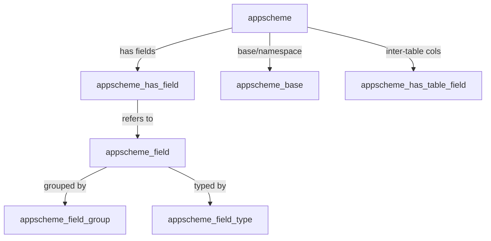

# Idae-Legacy

A legacy PHP 5.6 + Node.js CMS/CRM system with MongoDB backend, implementing an ORM-based GUI framework for dynamic data management with real-time synchronization.

## Overview

**Idae** is a comprehensive business application platform designed for complex CRM, invoicing, and scheduling operations with multi-tenant support and event-driven architecture.

### Key Technologies
- **Backend**: PHP 5.6 with ADODB ORM, MongoDB data persistence, MySQL 5.7 for legacy data
- **Real-time**: Node.js 12 socket.io server for live updates across clients
- **Architecture**: Schema-driven MVC with dynamic field binding, no explicit database schemas
- **Deployment**: Docker (Apache + PHP + MySQL 5.7 + Node.js 12)
- **Status**: Legacy maintenance mode - focus on stability over modernization

## What It Does

### Core Features

1. **Schema-Driven Data Management** (`AppScheme`)
   - Self-describing entity definitions stored in MongoDB
   - Dynamic field binding - no static database schemas required
   - Automatic field naming convention: `codeAppscheme_field` + table name (e.g., `nom` → `nomProduit`)
   - FK relationships with automatic grid/reverse grid management

2. **Hierarchical ORM System**
   - Base `App` class → `AppSite` (web-specific) → Domain models (`Idae`, `Act`, `Artis`)
   - MongoDB query interface with advanced filtering, sorting, pagination
   - UPSERT operations with atomic updates
   - Bulk operations support

3. **Role-Based Access Control**
   - Three-tier permissions: Agent → Agent Group → Table-level CRUD rights
   - App-level permissions (ADMIN, DEV, CONF, etc.)
   - Table-level permissions (Create, Read, Update, Delete, List, Configure)

4. **Real-Time Synchronization** (socket.io)
   - WebSocket-based live data updates across all connected clients
   - Room-based subscriptions per entity/table
   - HTTP endpoints for PHP → Node.js communication
   - Session-based authentication bridge

5. **Dynamic UI Generation**
   - Prototype.js-based client framework
   - Module system with dynamic component loading
   - Real-time data grids with filtering/sorting
   - Built-in drag-drop, charts (Chartist), date pickers (Pikaday), rich text editing (TinyMCE)

## Quick Start

### Prerequisites

- Docker & Docker Compose
- OR: PHP 5.6, Node.js 12, MongoDB, MySQL 5.7, Apache

### Using Docker (Recommended)

```bash
# Navigate to project root
cd /path/to/idae-legacy

# Start all services
docker-compose up

# Access application
# http://localhost:8080

# Default credentials
# Username: Mydde
# Password: malaterre
```

The Docker stack includes:
- Apache + PHP 5.6 on port 8080
- Node.js socket.io server on port 3005
- MongoDB for data storage
- MySQL 5.7 for legacy data

### Local Development

```bash
# Start PHP built-in server
cd idae/web
php -S localhost:8000 -t .

# In another terminal, start Node.js socket server
cd idae/web/app_node
npm install
node idae_server.js

# Access at http://localhost:8000
```

### Socket.io Server Management

The socket.io server can be managed using **forever** for background execution:

```bash
cd idae/web/app_node

# Install dependencies (includes forever)
npm install

# Start server in background
npm run start

# Stop server
npm run stop

# Check status
npm run status

# View logs
npm run logs

# Development mode (foreground, Ctrl+C to stop)
npm run dev
```

**Logs location**: `app_node/logs/` (socket-out.log, socket-err.log)

**Troubleshoot**:
- Kill all Node processes: `Stop-Process -Name node -Force` (Windows) or `pkill node` (Linux)
- Check MongoDB connection if startup fails
- Verify port 3005 is available: `netstat -an | findstr 3005`

## Application Bootstrap Flow

### Server-Side (PHP/Node.js)

1. **Initial Request** → `reindex.php` (session cleanup)
2. **Main Entry** → `index.php`
   - Load configuration (`conf.inc.php`)
   - Initialize database connections
   - Load all module schemes (`conf_init.php`)
3. **Module Registration** → `conf_modules/` (auto-discovered)
   - Each module calls `App::init_scheme()` to register entities
4. **Node.js Socket Server** → `app_node/idae_server.js`
   - MongoDB connection for shared state
   - HTTP endpoints for PHP communication
   - WebSocket listener for client subscriptions

### Client-Side (JavaScript)

1. **Resource Loading** → `main_bag.js`
   - bag.js cascade: boot → polyfill → framework → app modules
   - IndexedDB caching for performance

2. **Session Authentication** → `app_bootstrap_init.js`
   - Validate PHP session cookie
   - Bridge to socket.io server with session token
   - Load schema metadata from server

3. **UI Initialization** → `app_bootstrap.js`
   - Fetch entity schemas into `APP.APPSCHEMES`
   - Load module components dynamically
   - Establish real-time subscriptions

## Key Architecture Patterns

### Standard JSON API Endpoint

```javascript
// POST /services/json_data.php
{
  table: "produit",
  vars: { estActifProduit: 1, prixProduit: { "$gte": 100 } },
  page: 1,
  nbRows: 50,
  sortBy: "nomProduit",
  sortDir: 1,
  piece: "data"  // or "scheme" for metadata
}

// Response
{
  appscheme_field: [...field definitions...],
  records: [...data rows...],
  grilleFK: [...FK relationships...]
}
```

### Real-Time Flow

```javascript
// Client subscribes to table updates
socket.on('connect', () => {
  socket.emit('subscribe', { table: 'produit', scope: 'list_produit' });
});

// Server broadcasts when data changes
io.to('room_produit_list').emit('update', { 
  action: 'refresh',
  data: {...changed records...}
});

// Client refreshes UI
socket.on('update', (data) => {
  reloadModule(data.scope);
});
```

### Permission Model

**Check permission in PHP:**
```php
// App-level permission
if (droit('ADMIN')) { ... }

// Table-level permission (C=Create, R=Read, U=Update, D=Delete, L=List, CONF=Config)
if (droit_table($_SESSION['idagent'], 'R', 'produit')) { ... }
```

## Configuration

### Environment Detection

Configuration automatically detects environment based on hostname:

```php
// conf.inc.php (line 24-42)
if ('lan' === end($host_parts) || $host === 'localhost') {
  include_once('conf.lan.inc.php');      // Local dev
} else {
  DEFINE('ENVIRONEMENT', 'PROD|PREPROD'); // Production/Staging
}
```

### Configuration Files

- **`conf.lan.inc.php`** - Local development settings
- **`conf_modules/`** - Module configurations (auto-loaded)
- **`config/prod-hosts.json`** - Production hosts & connections
- **`config/lan-hosts.json`** - Local dev hosts & connections

## Scheme collections relationship (quick reference)

This short section shows how the main scheme collections relate to each other. For a complete, neutral description see `SCHEMA.md` at the project root.

- `appscheme`: top-level entity definition (table metadata). references: `codeAppscheme_base` (the base/namespace) and arrays such as `grilleFK`.
- `appscheme_base`: base/host/namespace for schemes — used to resolve the physical database or collection prefix.
- `appscheme_field`: reusable field definitions (type, label, icon, group).
- `appscheme_has_field`: per-entity binding that lists which fields are declared on an `appscheme` (order, mini flags).
- `appscheme_has_table_field`: cross-table column declarations used to include fields from other schemes in grids/columns.
- `appscheme_field_group`: logical grouping (tabs/sections) for fields; referenced by `appscheme_field` entries.
- `appscheme_field_type`: registry of field types that map `codeAppscheme_field_type` to rendering/validation rules.

Mermaid (conceptual):



Use `services/json_scheme.php` (or `services/json_scheme.php?piece=fields`) to retrieve the server-assembled JSON that joins these collections for client consumption.

### Key Constants

```php
APPPATH              // Project root
SITEPATH             // Web root
SOCKETIO_PORT        // Default: 3005
MONGO_HOST           // MongoDB host
SQL_HOST             // MySQL host
ENVIRONEMENT         // PROD|PREPROD|LAN
```

## Common Development Tasks

### Add a New Entity

```php
// 1. Create appscheme record
$app_schema = new App('appscheme');
$app_schema->create_update(
  ['codeAppscheme' => 'produit'],
  [
    'nomAppscheme' => 'Produit',
    'appscheme_field' => [
      ['codeAppscheme_field' => 'nom', 'typeField' => 'text'],
      ['codeAppscheme_field' => 'prix', 'typeField' => 'number']
    ]
  ]
);

// 2. Access via API
// POST /services/json_data.php?table=produit
```

### Query Data

```php
$app = new App('produit');

// Simple find
$records = $app->find(['estActifProduit' => 1])->sort(['nomProduit' => 1])->limit(50);

// Find one
$product = $app->findOne(['idproduit' => 123]);

// Create/Update (upsert)
$id = $app->create_update(
  ['idproduit' => 123],
  ['nomProduit' => 'Widget', 'prixProduit' => 99.99],
  ['upsert' => true, 'safe' => 1]
);

// Delete
$app->remove(['idproduit' => 123]);
```

### Create Migration Script

```bash
# Run custom migration
php migration.php

# Or execute migration from app_install/
php conf_install_go.php
```

### Trigger Real-Time Refresh

```php
// After updating data
file_put_contents(ACTIVEMODULEFILE, 'reloadModule("scope_name")');
// Socket server broadcasts to all subscribed clients
```

## Common Pitfalls & Solutions

| Issue | Solution |
|-------|----------|
| MongoId casting errors | Use `new MongoId($_POST['id'])`, not string comparison |
| Field name mismatch | Remember: `nomProduit` (not `nom`) - table name appended |
| ADODB cursor exhaustion | Re-query if iterating multiple times |
| Socket.io connection fails | Check port 3005 open, verify PHPSESSID in cookies |
| Socket.io MongoDB error | Don't use `.open()` or `.authenticate()` with modern driver - connection is already open |
| Type coercion issues | Cast IDs: `(int)$_POST['id']` before querying |
| Regex injection | Use `preg_quote()` before MongoDB regex patterns |
| Forever not starting | Run `npm install` first, ensure `.forever/logs/` directory exists in home |

## Performance Considerations

- **Pagination**: Always use `page`/`nbRows` in API calls
- **Indexes**: Create on frequently filtered/sorted fields
- **Query caching**: `AppSite` caches results - reuse instances
- **Bulk operations**: Use `multi` flag and `$set` operator
- **Socket rooms**: Broadcast to specific rooms, not globally

## Debugging

### Logs

- **PHP errors**: `/var/log/apache2/php-error.log`
- **Node.js stdout**: `app_node/logs/socket-out.log` (when using forever)
- **Node.js stderr**: `app_node/logs/socket-err.log` (when using forever)
- **Forever logs**: View with `npm run logs` or check `~/.forever/logs/`
- **MongoDB**: Check collection sizes with `db.collection.stats()`

### Enable Debug Mode

```php
// conf.lan.inc.php
ini_set('display_errors', 1);
DEFINE('ENVIRONEMENT', 'LAN');
```

### Browser Console

- Check WebSocket connections: `socket.connected`
- Network tab: Monitor `/services/json_*.php` calls
- Check session: `Cookies.get('PHPSESSID')`

## Directory Structure

| Directory | Purpose |
|-----------|---------|
| `appclasses/` | Core ORM classes - extend `App` for entities |
| `appconf/` | Bootstrap & module configurations |
| `app_node/` | Node.js socket server & daemons |
| `services/` | HTTP JSON endpoints (`json_data.php`, etc.) |
| `appfunc/` | Utility functions for data processing |
| `javascript/` | Client-side framework & modules |
| `tpl/` | HTML templates |
| `bin/` | Routes, templates, cron jobs |
| `mdl/` | Dynamic modules/components |

## Documentation References

- **ORM Query Methods**: See [appclasses/App.php](appclasses/)
- **Permission System**: [appfunc/function.php](appfunc/)
- **Socket.io Protocol**: [app_node/idae_server.js](app_node/)
- **API Endpoints**: [services/](services/)
- **Schema Definition**: [appconf/conf_init.php](appconf/)

## Support & Maintenance

This is a **legacy system in maintenance mode**. Focus is on stability and bug fixes rather than modernization. For issues or questions, refer to the Copilot instructions file in `.github/copilot-instructions.md`.

---

**Last Updated**: February 2, 2026  
**Framework**: PHP 5.6 / Node.js 12 (legacy)  
**Database**: MongoDB (v1.x Mongo extension)  
**Status**: Legacy Maintenance Mode
